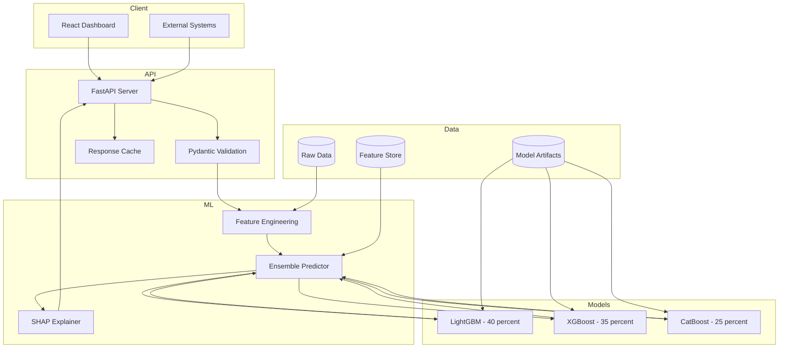
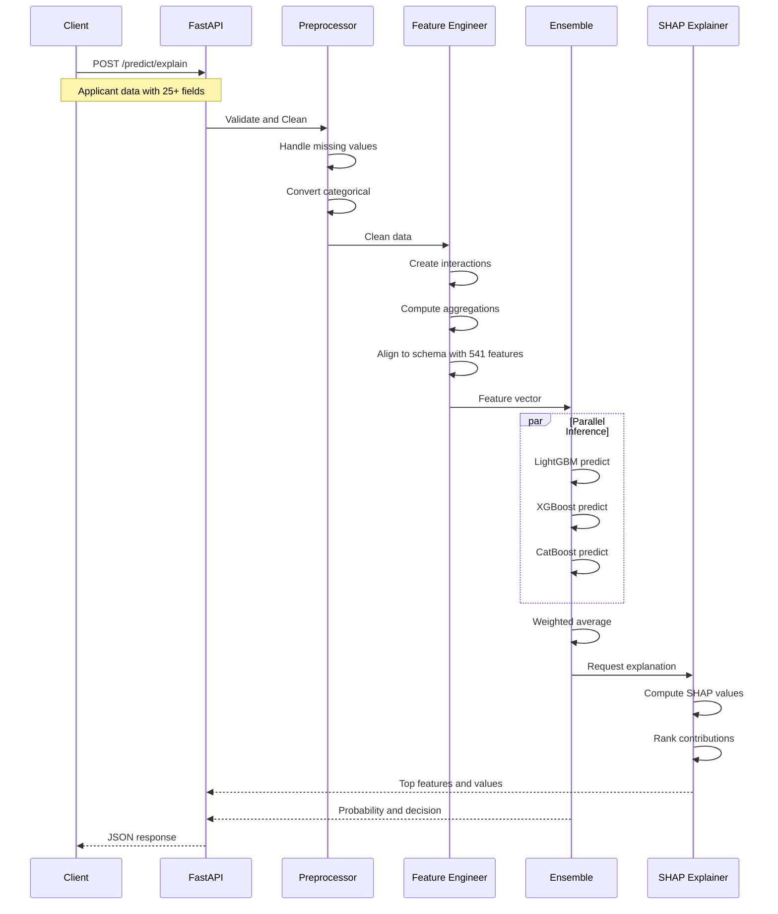
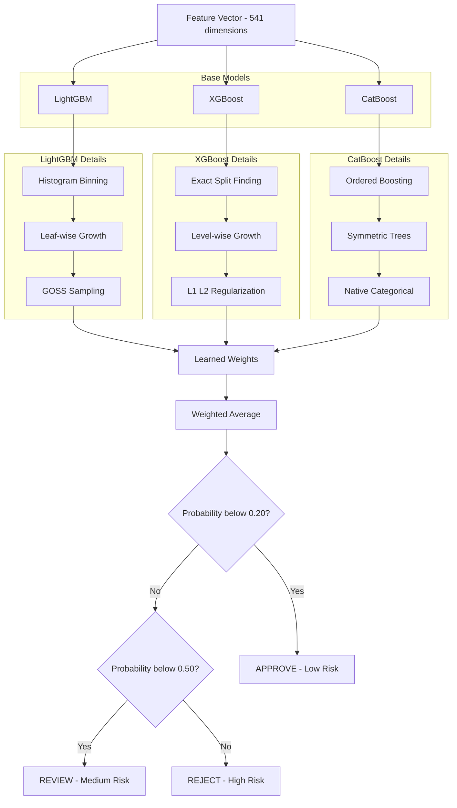
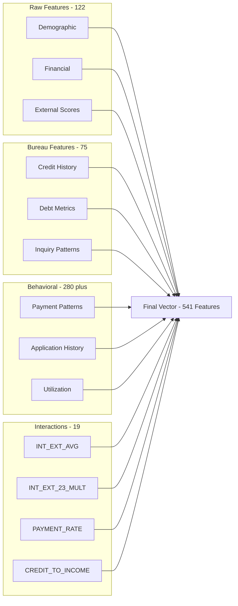
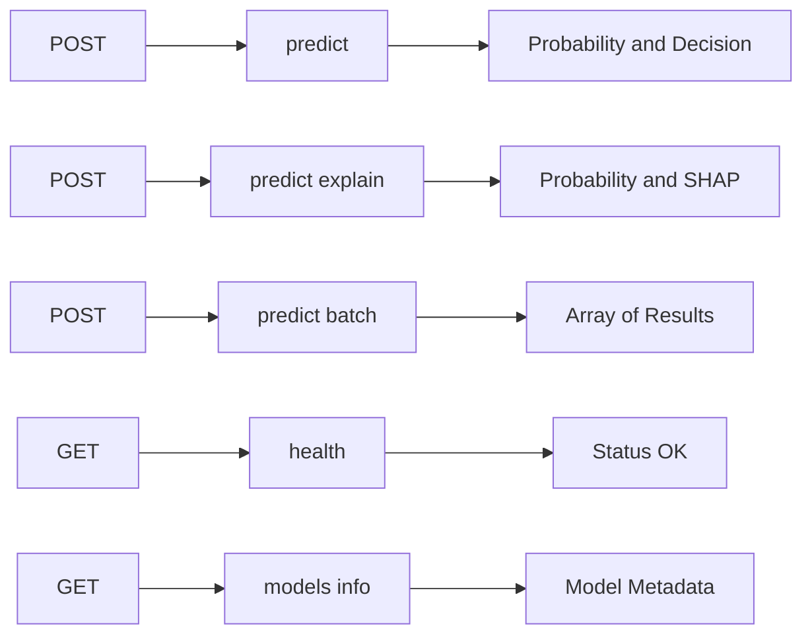
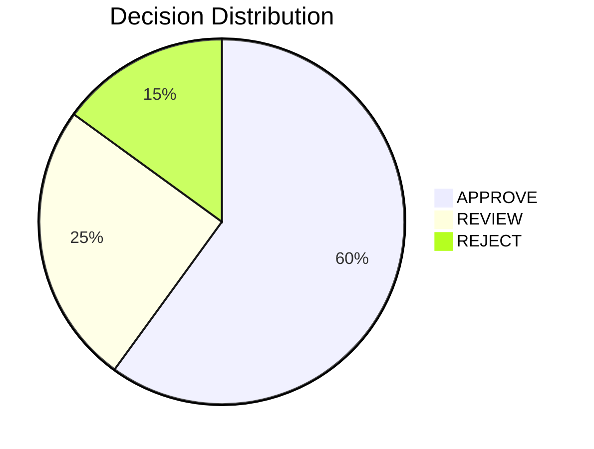
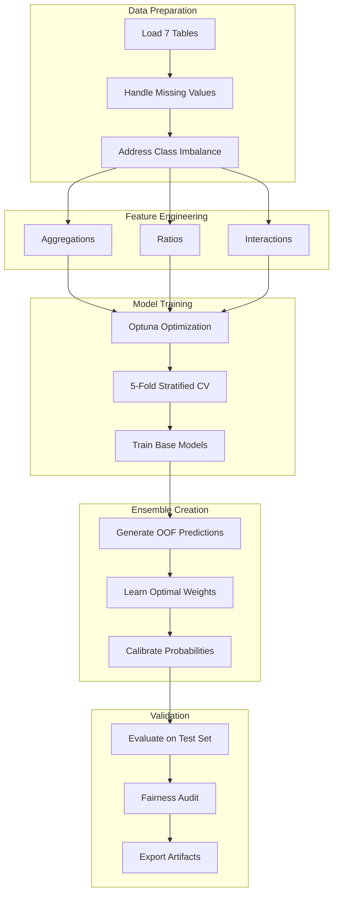
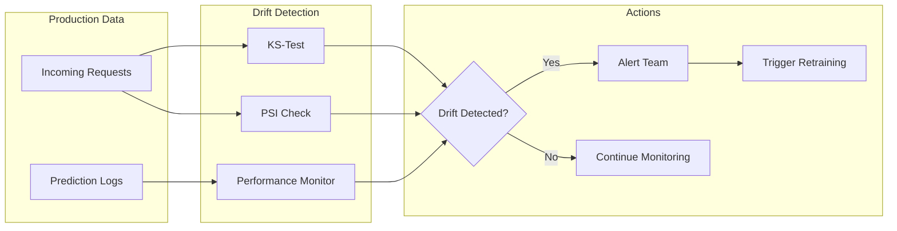
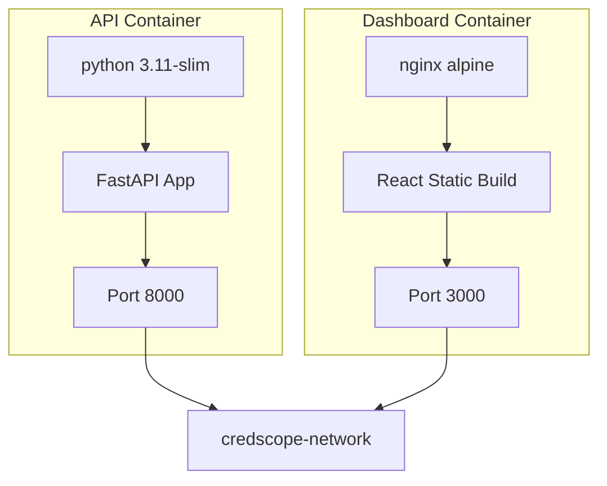

<p align="center">
  
  
  
  
  
</p>

<h1 align="center">CredScope</h1>
<h3 align="center">Alternative Credit Risk Intelligence Platform</h3>

<p align="center">
  <strong>A Machine Learning Approach to Financial Inclusion Using Ensemble Methods and Explainable AI</strong>
</p>

<p align="center">
  <a href="#features">Features</a> •
  <a href="#quick-start">Quick Start</a> •
  <a href="#architecture">Architecture</a> •
  <a href="#api-reference">API</a> •
  <a href="#performance">Performance</a> •
  <a href="#documentation">Docs</a>
</p>

---

## Overview

**CredScope** is an advanced credit default risk prediction system designed to enhance loan approval decisions for financial institutions. By leveraging a sophisticated ensemble of gradient boosting models and a modern full-stack architecture, the system delivers high-accuracy predictions with **explainability** and **fairness** at its core.

### The Problem

Traditional credit scoring systems exclude approximately **45 million Americans** classified as "credit invisible" — individuals without sufficient credit history for conventional scoring models. This includes:

| Population Segment   | Estimated Size | Characteristics                   |
| :------------------- | :------------: | :-------------------------------- |
| Young Adults (18-25) |      15M+      | Limited credit history due to age |
| Recent Immigrants    |      8M+      | No domestic credit history        |
| Unbanked/Underbanked |      12M+      | Preference for cash transactions  |
| Thin-File Consumers  |      10M+      | Fewer than 5 credit accounts      |

### Our Solution

CredScope leverages **alternative data sources** and **advanced ensemble methods** to provide fair, accurate, and interpretable credit risk assessments — enabling financial inclusion while maintaining robust risk management.

---

## Features

### Machine Learning

- **Weighted Ensemble** of LightGBM, XGBoost, and CatBoost
- **541 Engineered Features** from 7 relational data sources
- **Optuna-optimized** hyperparameters with 5-fold CV
- **Probability Calibration** for true default probabilities

### Explainability

- **SHAP Integration** for global and local interpretability
- **Feature Attribution** for every prediction
- **Regulatory Compliance** with fair lending laws
- **Natural Language** explanation generation

### Production-Ready

- **FastAPI** backend with sub-100ms latency
- **React 18 + Vite** modern frontend
- **Docker Compose** orchestration
- **Real-time and Batch** prediction modes

### Fairness and Monitoring

- **Demographic Parity** auditing with DI Ratio above 0.95
- **Drift Detection** with KS-Test and PSI
- **Automated Retraining** triggers
- **80% Rule Compliance** verification

---

## Quick Start

### Prerequisites

- Python 3.10+
- Node.js 18+
- Docker and Docker Compose (optional)

### Installation

```bash
# Clone the repository
git clone https://github.com/Xhadou/CredScope.git
cd CredScope-v1

# Create virtual environment
python -m venv venv
source venv/bin/activate  # On Windows: venv\Scripts\activate

# Install dependencies
pip install -r requirements.txt

# Download pre-trained models (if not included)
python scripts/download_models.py
```

### Running the API

```bash
# Start the FastAPI server
python -m uvicorn src.credscope.api.main:app --host 0.0.0.0 --port 8000

# The API will be available at http://localhost:8000
# Interactive docs at http://localhost:8000/docs
```

### Running the Dashboard

```bash
# Navigate to frontend directory
cd demo-site

# Install dependencies
npm install

# Start development server
npm run dev

# Dashboard available at http://localhost:5173
```

### Docker Deployment

```bash
# Build and run all services
docker-compose up --build

# Services:
# - API: http://localhost:8000
# - Dashboard: http://localhost:3000
```

---

## Architecture

### System Overview



### Data Flow Pipeline



### Ensemble Architecture



### Feature Engineering Pipeline



### Project Structure

```
CredScope-v1/
├── src/
│   └── credscope/
│       ├── api/                    # FastAPI application
│       │   ├── main.py             # API entry point
│       │   ├── routes/             # Endpoint definitions
│       │   └── schemas/            # Pydantic models
│       ├── models/                 # ML model implementations
│       │   ├── ensemble.py         # Weighted ensemble logic
│       │   ├── lightgbm_model.py
│       │   ├── xgboost_model.py
│       │   └── catboost_model.py
│       ├── features/               # Feature engineering
│       │   ├── engineering.py      # Feature creation
│       │   └── interactions.py     # Interaction features
│       ├── explainability/         # SHAP integration
│       │   └── shap_explainer.py
│       ├── monitoring/             # Drift detection
│       │   ├── drift.py
│       │   └── fairness.py
│       └── utils/                  # Utilities
│
├── demo-site/                      # React frontend
│   ├── src/
│   │   ├── components/
│   │   │   ├── Hero.jsx
│   │   │   ├── RealTimePrediction.jsx
│   │   │   └── EnsembleArchitecture.jsx
│   │   ├── App.jsx
│   │   └── main.jsx
│   ├── package.json
│   ├── vite.config.js
│   └── tailwind.config.js
│
├── models/                         # Trained model artifacts
│   ├── lightgbm_model.pkl
│   ├── xgboost_model.pkl
│   ├── catboost_model.pkl
│   └── ensemble_weights.json
│
├── notebooks/                      # Jupyter notebooks
│   ├── 01_EDA.ipynb
│   ├── 02_Feature_Engineering.ipynb
│   ├── 03_Model_Training.ipynb
│   └── 04_Evaluation.ipynb
│
├── tests/                          # Test suite
│   ├── test_api.py
│   ├── test_models.py
│   └── test_features.py
│
├── docker-compose.yml              # Container orchestration
├── Dockerfile.api                  # API container
├── Dockerfile.dashboard            # Frontend container
├── requirements.txt                # Python dependencies
└── README.md                       # This file
```

---

## API Reference

### Base URL

```
http://localhost:8000
```

### Endpoints

#### POST /predict

Get default probability for a single applicant.

**Request:**

```json
{
  "AMT_INCOME_TOTAL": 150000,
  "AMT_CREDIT": 500000,
  "AMT_ANNUITY": 25000,
  "DAYS_BIRTH": -12000,
  "DAYS_EMPLOYED": -2000,
  "EXT_SOURCE_1": 0.5,
  "EXT_SOURCE_2": 0.6,
  "EXT_SOURCE_3": 0.55
}
```

**Response:**

```json
{
  "probability": 0.182,
  "decision": "REVIEW",
  "risk_level": "MEDIUM",
  "confidence": 0.85
}
```

#### POST /predict/explain

Get prediction with SHAP-based feature contributions.

**Response:**

```json
{
  "probability": 0.182,
  "decision": "REVIEW",
  "risk_level": "MEDIUM",
  "top_features": [
    {"feature": "INT_EXT_AVG", "contribution": 0.053, "direction": "increases_risk"},
    {"feature": "PAYMENT_RATE", "contribution": -0.032, "direction": "decreases_risk"},
    {"feature": "CREDIT_TO_INCOME_RATIO", "contribution": 0.028, "direction": "increases_risk"}
  ],
  "shap_base_value": 0.081
}
```

#### POST /predict/batch

Process multiple applicants in a single request.

**Request:**

```json
{
  "applicants": [
    {"AMT_INCOME_TOTAL": 150000, "AMT_CREDIT": 500000},
    {"AMT_INCOME_TOTAL": 80000, "AMT_CREDIT": 200000}
  ]
}
```

#### GET /health

Health check endpoint.

#### GET /models/info

Get model metadata and ensemble weights.

### API Flow



---

## Performance

### Predictive Metrics

| Metric                        | Baseline | CredScope Ensemble | Improvement |
| :---------------------------- | :------: | :----------------: | :---------: |
| **ROC-AUC**             |  0.7450  |  **0.7908**  |    +6.1%    |
| **Gini Coefficient**    |  0.4900  |  **0.5816**  |   +18.7%   |
| **Precision (Top 10%)** |   0.28   |   **0.34**   |   +21.4%   |

### Model Comparison

| Model              |     AUC-ROC     | Weight | Inference Time |
| :----------------- | :--------------: | :----: | :------------: |
| Baseline           |      0.7450      |   -   |       -       |
| LightGBM           |      0.7900      |  40%  |      25ms      |
| XGBoost            |      0.7895      |  35%  |      30ms      |
| CatBoost           |      0.7889      |  25%  |      35ms      |
| **Ensemble** | **0.7908** |  100%  |      80ms      |

### Business Impact

| Metric                           | Value                    |
| :------------------------------- | :----------------------- |
| **Annual ROI**             | $12.5M per $1B portfolio |
| **Default Rate Reduction** | 8.1% to 6.0% (-2.1%)     |
| **Optimal Threshold**      | 0.085                    |
| **Approval Rate**          | 72% (maintained)         |

### Inference Performance

| Metric        |     Target     |       Achieved       | Status |
| :------------ | :-------------: | :------------------: | :----: |
| Latency (p50) |   below 500ms   |    **80ms**    |  Pass  |
| Latency (p95) |  below 1000ms  |   **150ms**   |  Pass  |
| Throughput    | above 100 req/s | **~200 req/s** |  Pass  |
| Model Size    |   below 50MB   |    **17MB**    |  Pass  |

### Decision Distribution



---

## Methodology

### Training Pipeline



### Key Engineered Features

| Rank | Feature                | Description                       | Type        |
| :--: | :--------------------- | :-------------------------------- | :---------- |
|  1  | INT_EXT_AVG            | Average of external credit scores | Interaction |
|  2  | INT_EXT_23_MULT        | EXT_SOURCE_2 times EXT_SOURCE_3   | Interaction |
|  3  | PAYMENT_RATE           | Annuity divided by Credit Amount  | Ratio       |
|  4  | CREDIT_TO_INCOME_RATIO | Debt burden indicator             | Ratio       |
|  5  | DAYS_EMPLOYED_PERC     | Employment stability vs age       | Ratio       |
|  6  | INT_EXT_MAX            | Maximum external score            | Interaction |
|  7  | INT_DOC_CREDIT         | Documents per credit unit         | Interaction |
|  8  | DAYS_BIRTH             | Age in days                       | Raw         |
|  9  | AMT_ANNUITY            | Loan annuity amount               | Raw         |
|  10  | INT_EXT_MIN            | Minimum external score            | Interaction |

**Key Finding:** 9 of the top 10 most important features are engineered interactions.

### Decision Thresholds

| Decision | Probability Range | Expected Percentage | Action        |
| :------- | :---------------: | :-----------------: | :------------ |
| APPROVE  |   p below 0.20   |        ~60%        | Auto-approve  |
| REVIEW   |   0.20 to 0.50   |        ~25%        | Manual review |
| REJECT   |   p above 0.50   |        ~15%        | Auto-reject   |

---

## Fairness and Compliance

### Fairness Metrics

| Metric                 | Gender | Age Groups | Status |
| :--------------------- | :----: | :--------: | :----: |
| Disparate Impact Ratio |  0.96  |    0.94    |  Pass  |
| Equal Opportunity Diff |  0.02  |    0.03    |  Pass  |
| 80% Rule Compliance    |  Yes  |    Yes    |  Pass  |

### Monitoring Pipeline



---

## Testing

```bash
# Run all tests
pytest tests/ -v

# Run with coverage
pytest tests/ --cov=src/credscope --cov-report=html

# Run specific test file
pytest tests/test_api.py -v

# Run integration tests
pytest tests/integration/ -v --slow
```

---

## Docker Deployment

### Development

```bash
# Build and run with hot reload
docker-compose -f docker-compose.dev.yml up --build
```

### Production

```bash
# Build optimized production images
docker-compose -f docker-compose.prod.yml up --build -d

# View logs
docker-compose logs -f

# Scale API service
docker-compose up --scale api=3
```

### Container Architecture



---

## Future Roadmap

### Phase-1

- **Neural Networks:** TabNet integration, SAINT architecture
- **Monitoring:** Real-time drift dashboard, Prometheus and Grafana

### Phase-2

- **Alternative Data:** Telco data integration, Utility payment history
- **Infrastructure:** Multi-region deployment, AutoML pipeline, A/B testing framework

### Phase-3

- **Advanced ML:** Graph Neural Networks, Federated learning
- **LLM Integration:** Natural language explanations, Automated report generation

---

## Contributing

We welcome contributions! Please see our [Contributing Guidelines](CONTRIBUTING.md) for details.

```bash
# Fork the repository
# Create your feature branch
git checkout -b feature/AmazingFeature

# Commit your changes
git commit -m 'Add some AmazingFeature'

# Push to the branch
git push origin feature/AmazingFeature

# Open a Pull Request
```

### Development Setup

```bash
# Install development dependencies
pip install -r requirements-dev.txt

# Install pre-commit hooks
pre-commit install

# Run linting
flake8 src/
black src/ --check

# Run type checking
mypy src/credscope
```

---

## Documentation

- [API Documentation](docs/api.md)
- [Model Documentation](docs/models.md)
- [Feature Engineering Guide](docs/features.md)
- [Deployment Guide](docs/deployment.md)
- [Fairness Analysis](docs/fairness.md)

---

## License

This project is licensed under the MIT License - see the [LICENSE](LICENSE) file for details.

---

## Author

**Pratyush**

- GitHub: [@Xhadou](https://github.com/Xhadou)

---

## Acknowledgments

- [Home Credit Default Risk Dataset](https://www.kaggle.com/c/home-credit-default-risk) - Kaggle Competition
- [SHAP](https://github.com/slundberg/shap) - Explainability framework
- [LightGBM](https://lightgbm.readthedocs.io/), [XGBoost](https://xgboost.readthedocs.io/), [CatBoost](https://catboost.ai/) - Gradient boosting libraries
- [FastAPI](https://fastapi.tiangolo.com/) - Modern Python web framework
- [React](https://reactjs.org/) and [Vite](https://vitejs.dev/) - Frontend framework and build tool

<p align="center">
  <sub>If you find this project useful, please consider giving it a ⭐</sub>
</p>
